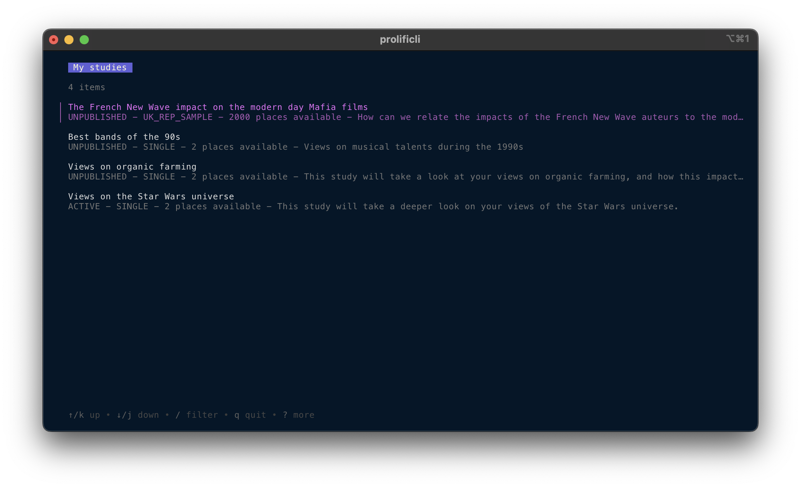
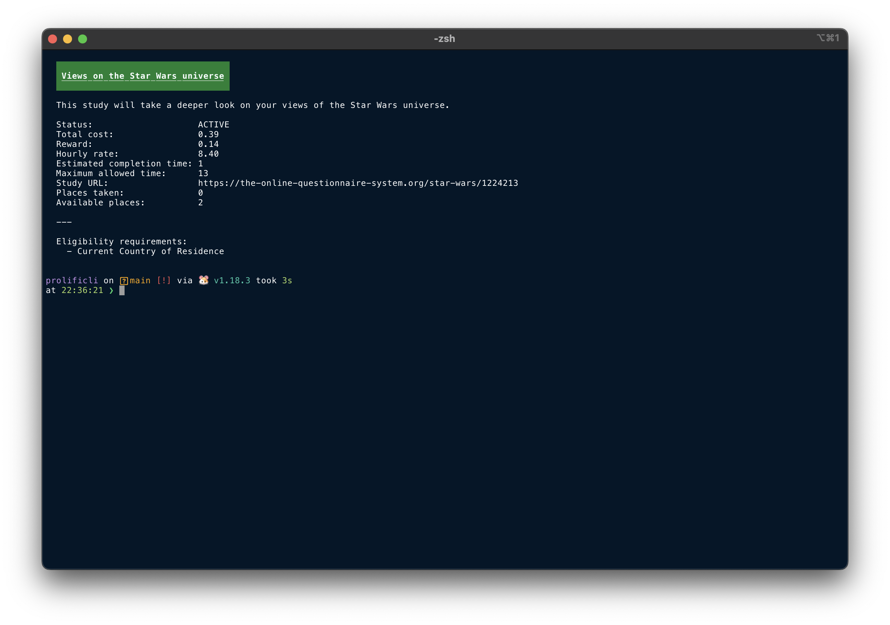

# Prolificli


[](https://goreportcard.com/report/github.com/benmatselby/prolificli)

CLI application for getting information out of [Prolific](https://www.prolific.co) about your research studies.

```text
CLI application for retrieving data from Prolific

Usage:
  prolificli [command]

Available Commands:
  completion  Generate the autocompletion script for the specified shell
  help        Help about any command
  requirement Requirement related commands
  studies     Provide details about your studies
  study       Study related commands
  user        User related commands

Flags:
      --config string   config file (default is $HOME/.benmatselby/prolificli.yaml)
  -h, --help            help for prolificli

Use "prolificli [command] --help" for more information about a command.
```





## Requirements

If you are wanting to build and develop this, you will need the following items installed. If, however, you just want to run the application I recommend using the docker container (See below).

- Go version 1.18+

## Configuration

You can create studies via a configuration file. See some examples in `/docs/examples`. It's one study per file.

You can then create a study by calling:

```shell
prolificli study create -t docs/examples/standard-sample.yaml
```

### Environment variables

You will need the following environment variables defining:

```shell
export PROLIFIC_URL="https://api.prolific.co"
export PROLIFIC_TOKEN=""
```

You can create a Researcher token in your account. Log in, and go to settings.

## Installation via Docker

Other than requiring [docker](http://docker.com) to be installed, there are no other requirements to run the application this way.

```shell
$ docker run \
  --rm \
  -t \
  -ePROLIFIC_URL \
  -ePROLIFIC_TOKEN \
  -v "${HOME}/.benmatselby":/root/.benmatselby \
  benmatselby/prolificli:latest "$@"
```

The `latest` tag mentioned above can be changed to a released version. For all releases, see [here](https://hub.docker.com/repository/docker/benmatselby/prolificli/tags).

| Tag      | What it means                                                                           |
| -------- | --------------------------------------------------------------------------------------- |
| `latest` | The latest released version                                                             |
| `main`   | The latest git commit, not released as a tag yet                                        |
| `v*`     | [Docker releases](https://hub.docker.com/repository/docker/benmatselby/prolificli/tags) |

You can also build the image locally:

```shell
make docker-build
```

## Installation via Git

```shell
git clone git@github.com:benmatselby/prolificli.git
cd prolificli
make all
./prolificli
```

You can also install into your `$GOPATH/bin` by running `make build && go install`.
